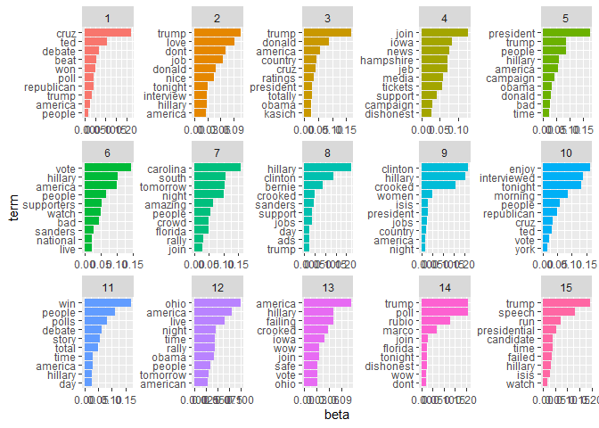

Topic modeling of Trump tweets in the year leading up to the 2016
election
================

Use the ‘topicmodels’ package to build a topic model of tweets from
Donald Trump’s account from November 2015-2016. Data come from [Brady et
al. 2018,
JEP:G](https://drive.google.com/file/d/10_FmQztDDtMQ4XxkjHoSIJoPlkfIA-DR/view),
which you can download at the paper’s OSF repository:
[“trump\_raw.csv”](https://drive.google.com/file/d/1wsAo-THT-cKF05IG7plya-Rf719LDe1F/view?usp=sharing).

## Setup

``` r
# load libraries ----
library(rtweet)
library(tidyverse)
library(tidytext)
library(stringr)
library(tm)
library(topicmodels)
library(ldatuning)
library(tictoc)

# load data
setwd("G:/My Drive/Website")

data <- read_csv("trump_raw.csv")
```

## 1 - Preprocessing

``` r
# select only columns we need for topic modeling
data_clean <- data %>% select(created_at, text)

# create idx to keep track of each "document" (tweet)
# we make it a factor for the cast_dtm function below
data_clean <- data_clean %>%  mutate(idx = as.factor(row_number()))

# remove URLs
data_clean$text <- gsub("https\\S*","", data_clean$text)
# remove "@username" tags
data_clean$text <- gsub("@\\w+", "", data_clean$text) 
# remove hashtags
data_clean$text <- gsub('#\\S+', '', data_clean$text)

# put data into tidy text format - note we use 'token = 'tweets'' for twitter-specific text preprocessing
data_tidy <- data_clean %>% 
  unnest_tokens(word, text, token = "tweets") %>% 
  # remove numbers
  filter(!str_detect(word, "^[0-9]*$")) %>%
  # remove stop words
  anti_join(stop_words)
  # stem the words
  #mutate(word = SnowballC::wordStem(word))

# get rid of unicode for the & symbol ("amp")
data_tidy <- data_tidy %>% filter(word != "amp")
```

## 2 - Create a document term matrix. For more details, see this [helpful chart](https://www.tidytextmining.com/images/tidyflow-ch-6.png) made by Julia Silge

``` r
data_dtm <- data_tidy %>% 
  # get count of each token in each document
  count(idx, word) %>%
  # create a document-term matrix with all features and tfidf weighting
  cast_dtm(document = idx, term = word, value = n, weighting = tm::weightTf)

# view
data_dtm

# remove sparse terms
data_dtm_trim <- removeSparseTerms(data_dtm, sparse = .99)
data_dtm_trim

# we need to get rid of rows with none of the non-sparse terms
rowTotals <- apply(data_dtm_trim, 1, sum) #Find the sum of words in each Document
data_dtm_final <- data_dtm_trim[rowTotals> 0, ] 
```

## 3 Create a topic model using Latent Dirichlet Allocation (LDA)

``` r
#create topic model with 10 topics
tweets_lda <- LDA(data_dtm_final, k = 10, control = list(seed = 1234))

# get the beta values for each word, which attribute each word a probability for each topic
tweet_topics <- tidy(tweets_lda, matrix = "beta")

# make dataframe showcasing the 10 words with highest beta per topic
tweet_top_terms <- tweet_topics %>%
  group_by(topic) %>%
  top_n(10, beta) %>%
  ungroup() %>%
  arrange(topic, -beta)

# plot top words for each topic
tweet_top_terms %>%
  mutate(term = reorder_within(term, beta, topic)) %>%
  ggplot(aes(term, beta, fill = factor(topic))) +
  geom_col(show.legend = FALSE) +
  facet_wrap(~ topic, scales = "free") +
  coord_flip() +
  scale_x_reordered()
```

<!-- -->

By examining these topics, we can notice a few patterns, but of course
this is the researcher interpreting the data-driven approach so consider
it very exploratory. For instance, Topic 1 appears to show Trump
tweeting about Ted Cruz and how he’s doing in polls against other
Republicans. On the other hand, topics like 2 are more about attacking
Clinton. Topic 4 is maybe about rallying people in specific states like
iowa, new hampshire and ohio.

## 4 - Model tuning. If you don’t know how many topics to expect a priori, choosing the correct number of models can be difficult. To use a data-driven approach, we can use the package ‘ldatuning’.

``` r
# Use 'ldatuning' package to find optimum number of topics. Note I'm using quad-core CPU
topic_n <- FindTopicsNumber(dtm = data_dtm_final , topics = seq(from = 2, to = 30, by = 1), 
                           metrics = "Griffiths2004", 
                           method = "Gibbs",
                           control = list(seed = 123),
                           mc.cores = 4L,
                           verbose = TRUE)
```

    ## fit models... done.
    ## calculate metrics:
    ##   Griffiths2004... done.

``` r
# plot result
FindTopicsNumber_plot(topic_n)
```

<!-- -->

It appears that after around 15 topics we aren’t gaining more
explanatory power. But we can increase our K to 15 since previously we
used 10.

## 5 - Rerun and inspect topic model with 15 topics

``` r
# run topic model
tweets_lda <- LDA(data_dtm_final, k = 15, control = list(seed = 1234))

# get the beta values for each word, which attribute each word a probability for each topic
tweet_topics <- tidy(tweets_lda, matrix = "beta")

# make dataframe showcasing the 10 words with highest beta per topic
tweet_top_terms <- tweet_topics %>%
  group_by(topic) %>%
  top_n(10, beta) %>%
  ungroup() %>%
  arrange(topic, -beta)

# plot top words for each topic
tweet_top_terms %>%
  mutate(term = reorder_within(term, beta, topic)) %>%
  ggplot(aes(term, beta, fill = factor(topic))) +
  geom_col(show.legend = FALSE) +
  facet_wrap(~ topic, scales = "free") +
  coord_flip() +
  scale_x_reordered()
```

<!-- --> Did this buy
us much? With the extra topics we get some extra themes that look like
trash-talking Rubio and his performance in Florida (topic 14) and maybe
some Clinton conspiracy chatter (topic 15). Perhaps these could explain
variance in outcomes if we used the LDA model to classic whole tweets
(documents) in terms of their probabilities in fitting into one of the
topics. This can be done by pulling the “gamma” values for each tweet
already stored in the LDA model we built.

## 6 - Use gamma values to categorize tweets by topic

``` r
# pull out gamma values per tweet per topic
gamma_document <- tidy(tweets_lda, matrix = "gamma")

# as an example, we can look at a tweet with the highest gamma for a topic.
tweet_example <- gamma_document %>% filter(gamma == max(gamma)) %>% print()
```

    ## # A tibble: 1 x 3
    ##   document topic  gamma
    ##   <chr>    <int>  <dbl>
    ## 1 1045         7 0.0831

``` r
# check the tweet
print(data_clean[tweet_example$document,2])
```

    ## # A tibble: 1 x 1
    ##   text                                                                          
    ##   <chr>                                                                         
    ## 1 Iowa was fantastic last night, amazing crowd and people. I'm now in Florida, ~

We see topic 7 appears to be about words pertaining to Trump’s rallys in
certain states. Tweet 1045 had the highest probability of being in topic
7, and this checks out as the tweet is about how well his rally in Iowa
went and looks forward to other state rallys.
